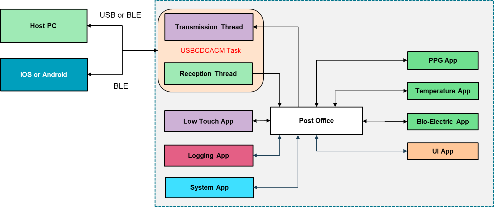

# Firmware Architecture

## Block Diagram

Reference firmware architecture:

Architecture for discussion:

## Firmware SDK dependency
This firmware SDK is developed as a project for the nRF5 SDK from Nordic
* [Link to the nRF5 SDK](https://www.nordicsemi.com/?sc_itemid=%7B21C26716-5F2C-4E2D-9514-C9B87B711114%7D)

## Target Microprocessor
The target processor of this SDK is the Nordic nRF52840 QFN73 package.
* [Link to the nRF52840 IC](https://www.nordicsemi.com/?sc_itemid=%7B2DC10BA5-A76E-40F8-836E-E2FC65803A71%7D)

## Firmware Operating System
### FreeRTOS
This firmware development is based on freerots
* [nrf5 SDK freerots]()
* [freertos user manual]()

## Modules

### Systems Modules
#### [PM Module]()
#### [Startup Initialization]()

### Protocol Modules
#### [M2M2 Module]()
#### [Post Office Module]()

### Input Modules
To all developers: These names, definitions and conventions are open for discussion.

#### [ACC Module]()

#### [ECG 1 Module]()

#### [ECG 2 Module]()

#### [ECG 3 Module]()

#### [Z2E Module]()

#### [Z4E Module]()

#### [Z2E4K Module]()

#### [TEMP4K Module]()

#### [TEMPIC Module]()

#### [BATMON Module]()

#### []

### Output Modules
#### [LCD Module]()
#### [BLE Module]()
#### [USB Module]()

## Drivers
