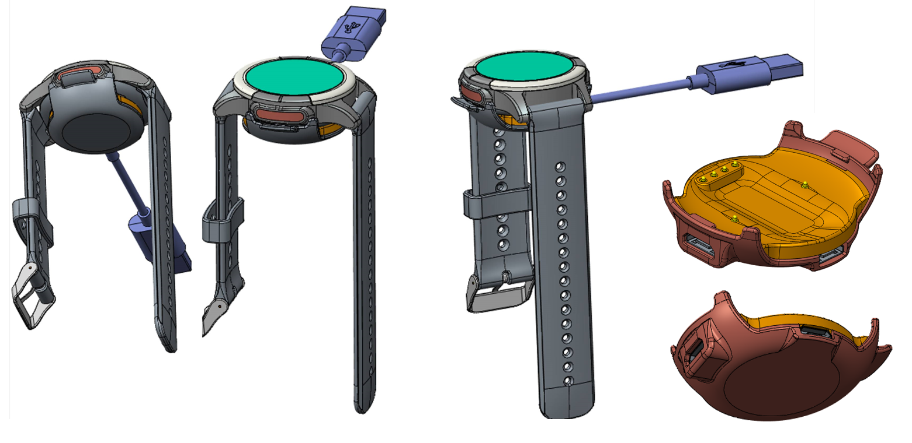
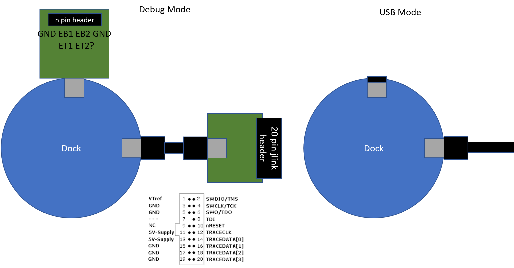

# Dock Interface
The Study watch interfaces to external devices physically via a dock as illustrated below.

This dock enables:
* Charging of the watch device
* USB data transfer from the watch/dock to a computer
* Development and debugging access to the ARM Cortex-M4 MCU via SWDIO and SWCLK through a JLINK debugger.

The proposed usage is outlined in the figure below.

## Physical Connections
### 6 Pogo Pins
There are 6 pogo pins on the watch, as shown in the figure above, these pins consists of a group of 4 pins for USB (micro) connection, and 2 pins for connections to the two bottom electrodes.

### 2 Micro USB Female Connectors
There are two micro USB female connectors on the dock:

1) on the dock, the USB connector on the watch button side is the main USB connector that can either
    * connects to a power source or a computer USB port for charging, and in addition,
    * to transfer data to and from a computer via the USB standard.

2) There is another female USB micro connector directly underneath the watch band on the dock that is typically capped during normal use.  This connector allows developer to gain access to the bottom two electrodes on the watch.

## USB Mode
In the USB mode, the watch is cradled in the dock, and the dock connects directly to a computer through a micro USB to USB A cable.

The watch device recognize the USB connection if the supply voltage on the USB_5V pin exceeds 3.6V, and the USB D+ and D- signal on the connector are then routed to the MCU USB signal lines.

## Debug Mode
Debug mode is enabled via an add-on board to interface directly to JLINK debugger through the standard 20 pin connector.

In this mode, the USB_5V pin is supplied by a voltage less than 3.6V (but >2.5V to keep the power management IC up), the watch circuitry then connects the D+ and D- signals on the connector to SWDIO and SWCLK pins on the MCU.

It is still undecided on whether the voltage on USB_5V shall be monitoring by the MCU or a standalone comparator with a standard reference voltage of 1.8V directly routed from the MCU supply.

## Electrode Breakout board
To be finalized
