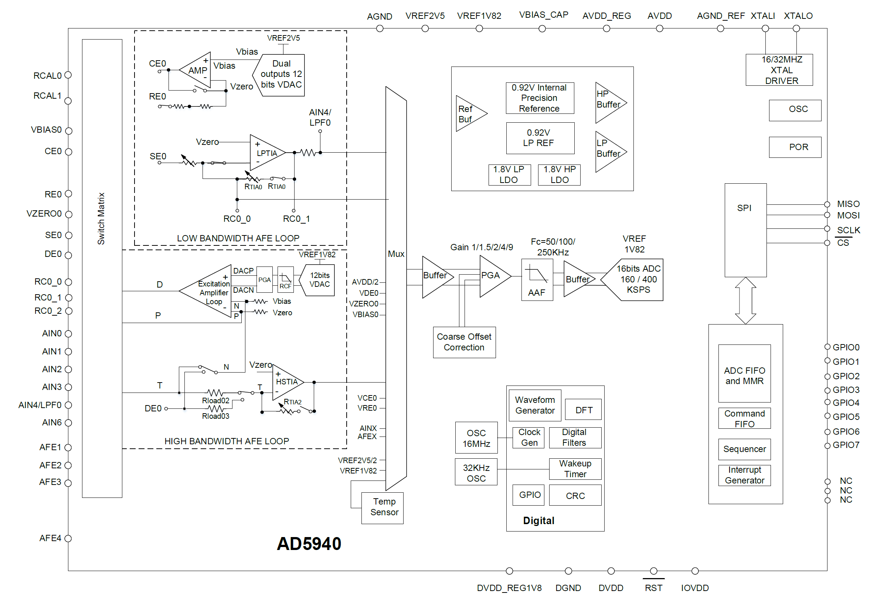

# ECG ADC

The main ECG signal chain uses the AD5940 for ECG digitization. Detailed specification and application notes on this part can be found at

[AD5940 Product Page](https://www.analog.com/en/products/ad5940.html)

The ECG output from the [ECG amplifier](./ad8233_amplifier) feeds directly to one of the analog input (AIN0) of the AD5940. A block diagram of the AD5940 is shown below.

## Concept

Here is the plan on how to sample the ECG signal on the AIN0 pin:

0) Use the default 16MHz crystal for operation
1) Bypass switch matrix, only use ADC MUX
2) Mux AIN0 to Buffer input+
    - MUXSEL_P = AIN0
3) Mux internal 1.11V Voltage source to Buffer input-
    - MUXSEL_N = VREF1V11
4) Currently use a PGA gain of 1
5) Use default 800KHz ADC sampling rate
    - ADCFILTERCON[0] = 1
6) Use the following filters, sinc3, sinc2, 50/60Hz notch, for a final output rate of 300sps
    - AFECON[10] = 1 enable INA
    - AFECON[7] = 1 enable ADC
    - AFECON[8] = ADC start
    - PMBW[3:2] = 01b, use lowest AAF bandwidth, i.e. 50KHz
    - ADCFILTERCON[4] = 0, disable notch filter bypass
    - AFECON[16] = 1, also notch enable
    - ADCFILTERCON[13:8] = 01_1011b, 10_1011b? there appears to be a typo in the datasheet
    - PMBW[0] = 0
    - Output read at SINC2DAT register

### Note on ADC Gain

LSB = Vindiff / Vref * 2^15 + 2^15. Double check this

### Note on SPI
Write Command Byte and Configure address
1. Drive CS low
2. Send 8 bit command byte: SPICMD_SETADDR
3. Send 16-bit address of register to read to or write from.
4. Pull CS high

Write Data to register
1. Drive CS low
2. Send 8 bit command byte: SPICMD_WRITEREG
3. Write either 16-bit or 32-bit data to register.
4. Bring CS high

Read Data from Register
1. Drive CS low
2. Send 8 bit command byte: SPICMD_READREG
3. Transmit a dummy byte on the SPI bus to initiate a read.
4. Read returning 16-bit or 32-bit data
5. Bring CS high

Reading Data from the Data FIFO

There are two methods to read back data from the data FIFO:
1. Read DATAFIFORD register as outlined in the previous paragraph.
2. Implement a fast FIFOREAD protocol

If there are less than three results in the data FIFO, the data should be read as outlined in point 1 above. However, if there are more than three results in the FIFO a much more efficient SPI transaction protocol is implemented. The protocol is outlined below.

Read Data from data FIFO
1. Drive CS low
2. Send 8 bit command byte: SPICMD_READFIFO
3. Transmit six dummy bytes on SPI bus before valid data can be read back.
4. Continuously read DATAFIFORD register until only two results are left.
5. Read back last two data points using a non-zero offset.
6. Pull CS high.
The transaction protocol is shown in Figure 45. Six dummy reads are needed before valid data is returned on the APB (Arm Peripheral Bus). The diagram also shows why the last two FIFO results are read back with a non-zero offset. Note APB read C. The APB will read data C while the SPI bus is transferring data B. So assuming Read B is the last data in FIFO, ROFFSETC is set to non–zero value. Then the APB will read a different register to the DATAFIFORD. If it continues to read DATAFIFORD register, the data FIFO will underflow causing an underflow error.

### Sequencer
One interesting feature of the AD5940 IC is that it has a command sequencer, with size of 6KB and update to 4 sequences can be stored and selectively used.

### FIFO or Register Read per Sample?

#### Synchronized Register Read
Let's start with SPI read on every sample.  This method distributes peripheral utilization and processing in most primitive chunks on the MCU chip.

Some considerations:
EastDMA current : 1.5mA
PPI current: 100uA
GPIOTE current:
SPI current: 50uA
HFCLK current:

#### FIFO Read

ADC reference 1.82V

Input range is then +/-0.9V
