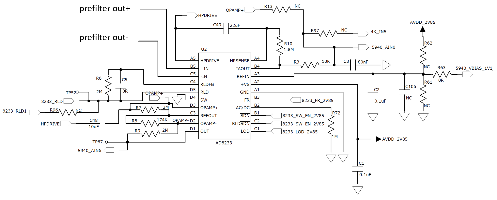

# ECG Amplifier

This signal chain uses the AD8233 ECG amplifier to prepare the signal for ADC digitization. Detailed specification and application notes on this part can be found at

[AD8233 Product Page](https://www.analog.com/en/products/ad8233.html)

The following schematic shows the usage of the AD8233 ECG amplifier in the watch.

## IOs

* Supply
    - VS: positive supply, connects to AVDD_2V85
    - GND: connects to device Ground
* Analog Input
    - +IN: ecg input positive, from prefilter output
    - -IN: ecg input negative, from prefilter output
    - REFIN: amplifier and RLD voltage reference input, from AD5940 VBIAS_1V1 decoupling output.
* Analog Output
    - 5940_AIN0: main ECG signal output to ADC on AD5940
    - 5940_AIN6: experimental output to ADC on AD5940
    - 8233_RLD: right leg drive output signal to electrode
    - REFOUT: buffered reference voltage output
* Digital Input
    - FR: fast restore enable, signal source from AD5940 GPIO
    - AC/nDC: AC or DC leadoff detect, default to DC detection mode via a 1Mohn pulldown resistor
    - nSDN: amplifier enable, signal source from AD5940 GPIO
    - RLDnSDN: RLD enable, tied with nSDN, default enabled with amplifier
* Digital Output
    - LOD: leadoff detect, active high, signal destination at MCU

## Differential Gain
The AD8233 performs a differential to single ended conversion through an Instrumentation Amplifier (INA) frontend.  Only the INA is used currently for main signal path. The built in gain of the INA is 100.

## Signal Conditioning
* This AD8233 amplifier implementation uses simple signal conditioning, which includes a
    - first order passive lowpass filter at the output of the amplifier, and the
    - first order highpass feature of the AD8233 hardware.
### Lowpass
The first order low pass filter is a simple RC filter.  The corner frequency of the filter is 200Hz.

### Highpass
The AD8233 employees a DC cancelation technique to achieve AC coupling at the frontend. The highpass filter corner is currently set at 0.4Hz via a first order RC network.

### GBW of INA
In addition the INA has a gain bandwidth around 70KHz.  With respect to a built in gain of 100, this give a lowpass corner around 700Hz.

## Resistor Options
### ECG Output
For the engineering board, the main ECG output of the circuit can be routed to:
1) analog input of AD5940: default
2) analog input of the onchip opamp: through R97
3) analog input of ADPD4000: throught R13

### Reference Voltage Input
There are two reference voltage options:
1) voltage from AD5940 VBIAS_1V1 decoupling output: default connected through R63
2) voltage generated by dividing down, using R61 and R62, the analog supply voltage for the AD8233.

## Experimental
The additional opamp on the AD8233 is not used by default for the main ECG signal path. A bandpassed component of the ECG signal, from 0.01Hz to 0.4Hz is extracted and amplified through this opamp at a gain of 8 for experiment use.
