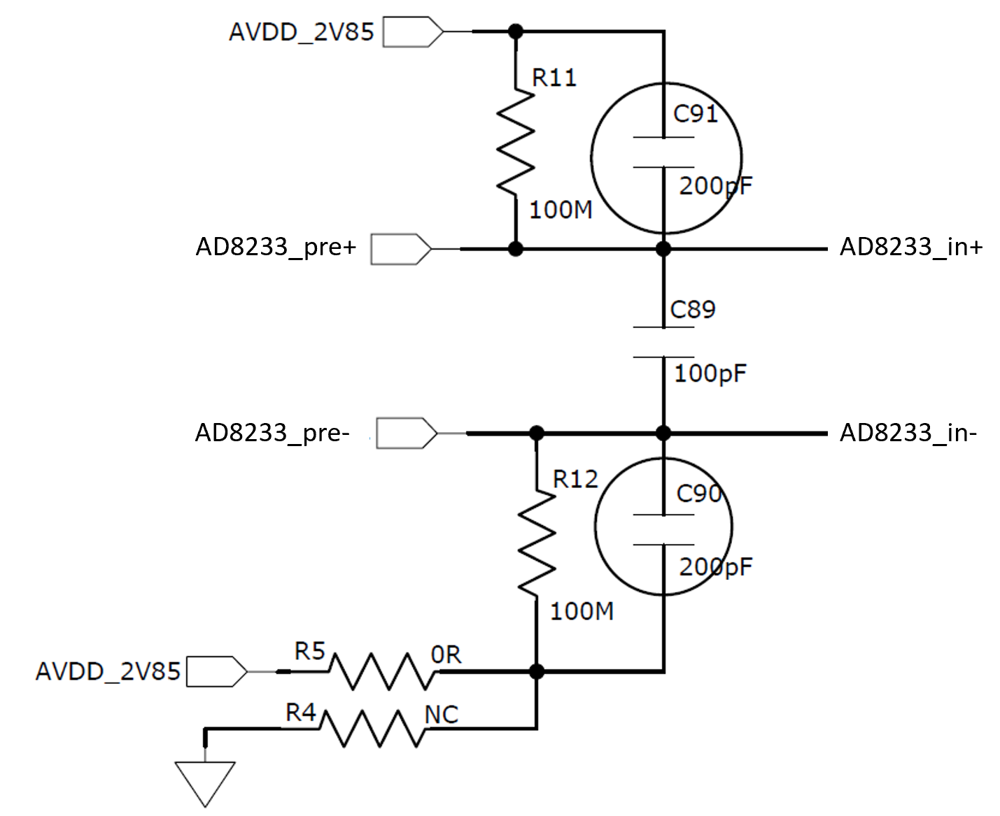

## Prefilter

The prefilter provides first line of signal conditioning from the electrodes to the inputs of the AD8233 ECG amplifier. It works in collaborator with the 150Kohm protection resistor inline to each electrode.

Assume the electrode impedance is (up to) 2Mohm, the prefilter provides a first order
* differential lowpass corner at 188Hz, and a
* common mode lowpass corner at 366Hz.

Without adding the impedance contributed by each electrode, the prefilter
* differential lowpass corner is at 2.5KHz, and its
* common mode lowpass corner is about 5KHz.

## Input Biasing
Another (third) electrode is used in collaboration with these two electrode for ECG sensing.  The third electrode is the right leg drive electrode (RLD) which biases human body and hence the sensing electrodes in the middle of the supply rail for the ECG amplifier with respect to device ground, and also to provide some suppression to common mode noise.

## Pullup
There is a 100Mohm pullup resistor at each input of the prefilter.  This pullup is used for leadoff detection on each electrode. See [AD8233 App Note]() for details.

## Resistor Options
Resistors R5 and R4 as shown in the schematic above provide an option to provide pull down or pull up in absence of a RLD electrode for a [two electrode ECG leadoff detect]() configuration. By default:
* R5 is 0 ohm (short) and
* R4 is not populated (open)
